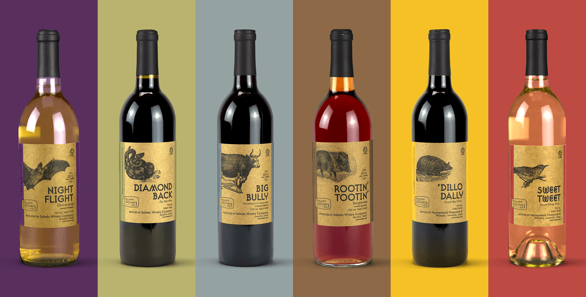
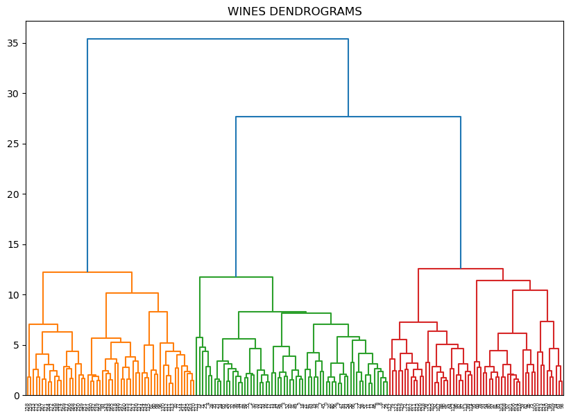
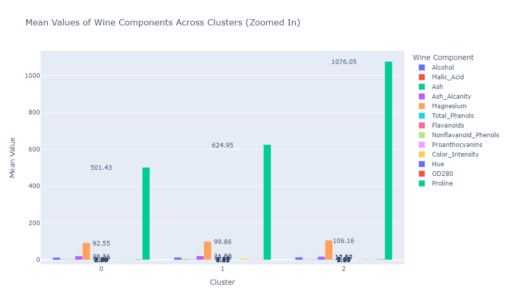

# **Similar Wine Grouping | Hierarchical Clustering**  



## **INTRODUCTION**  
The wine industry offers a vast selection of wines, each with unique characteristics. Grouping similar wines based on their features helps in **recommender systems**, **inventory management**, and **customer preferences analysis**.  

This project uses **Hierarchical Clustering** to segment wines into meaningful groups based on key attributes such as **acidity, alcohol content, and sweetness**.  

---

## **PROBLEM STATEMENT**  
With numerous wine varieties, manually categorizing them is inefficient. The goal of this project is to:  
- **Identify natural groupings of wines** based on their chemical properties.  
- **Visualize the hierarchical clustering results** for clear interpretability.  
- **Provide insights on wine similarity for better recommendations.**  

---

## **SKILL DEMONSTRATION**  
- **Data Preprocessing & Feature Selection**  
- **Unsupervised Learning (Hierarchical Clustering)**  
- **Dendrogram Visualization & Interpretation**  
- **Feature Scaling & Similarity Analysis**  

---

## **DATA SOURCING**  
- The dataset consists of **wine samples**, with features including:  
  - **Acidity (pH levels, fixed acidity, volatile acidity)**  
  - **Alcohol percentage**  
  - **Sulfur dioxide levels**  
  - **Sugar content**  
  - **Other chemical properties affecting taste and quality**  

---

## **DATA PREPROCESSING**  
- **Handling Missing Values:** Imputation or removal of missing data.  
- **Feature Normalization:** Standardizing numerical values to ensure accurate clustering.  

## **MODELLING: HIERARCHICAL CLUSTERING**  
- **Linkage Method:** Using **Ward's method** for optimal hierarchical clustering.  
- **Dendrogram Analysis:** Visualizing the cluster hierarchy.  
- **Cluster Formation:** Assigning wines into distinct groups based on their characteristics.  



## **ANALYSIS & VISUALIZATION**  
- **Dendrogram Plot:** Visual representation of hierarchical clustering.  
- **Cluster Labeling:** Assigning wines to different groups.  
- **Interpretation of Similarity:** Understanding key characteristics that define each group.  

### **Dendrogram Visualization Example**
```python
import scipy.cluster.hierarchy as sch
import matplotlib.pyplot as plt

plt.figure(figsize=(10, 6))
dendrogram = sch.dendrogram(sch.linkage(wine_data, method='ward'))
plt.title("Wine Clustering Dendrogram")
plt.xlabel("Wine Samples")
plt.ylabel("Distance")
plt.show()
```



## **CONCLUSION**  
- **Hierarchical clustering successfully groups wines based on chemical properties.**  
- **Dendrogram visualization helps interpret wine similarities.**  
- **Insights from clustering can improve wine recommendations and inventory management.**  
